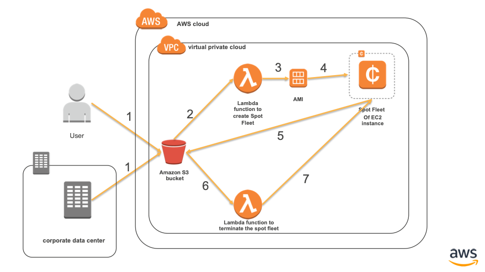
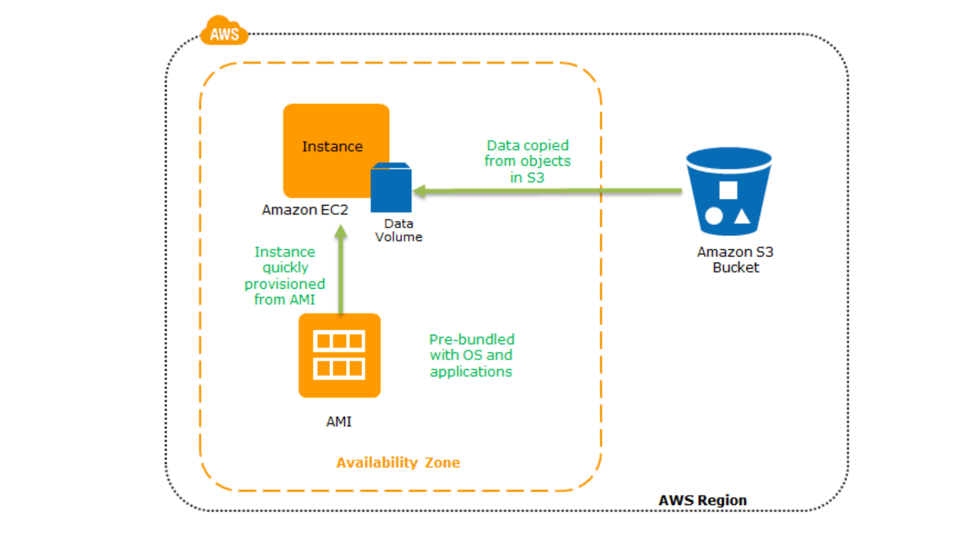

# **Automated Spot Fleet lifecycle for High Performance Computing Scenario**

## Description
Amazon Web Services is very popular for large-scale computing scenarios such as scientific computing, simulation, and research projects. These scenarios involve huge data sets collected from banking or retail equipment, measurement devices, or other compute jobs. After collection, these data sets need to be analyzed by large-scale compute jobs to generate result data sets. We can use a spot fleet of EC2 instances to compute your dataset uploaded to Amazon S3.

## Lab Overview
In this sample, we will demonstrate a prescriptive approach to launch a fleet of spot instances using AWS Lambda as soon as the dataset is uploaded to Amazon S3. Once the instances are allocated and up, the application downloads the dataset from Amazon S3 and processes it to generate output. This output then will be uploaded to Amazon S3 which will trigger a lambda function that terminates the spot instances launched.

## Architecture

1.	User uploads the transaction data to Amazon S3 by the end of the day.
2.	The S3 bucket that have a Lambda Function configured to trigger on upload of any object into it.
3.	This Lambda Function will create a fleet of Spot Instances as per the pre configured Launch Template. The Launch template uses the custom AMI we have built for our use case. The Lambda function can also override some properties of Launch Template like Spot Price, No. of instances etc. 
4.	The instances launched by Lambda are provisioned by AWS at the spot prices at that instant. The instance lifetime depends on the type of Spot instance we choose, i.e. if we choose one-time spot, the instances last as long as the spot price is less than our bid price. We can also choose to block the spot instance up to 6 hours while requesting it.
5.	If we choose persistent spot, then as soon as an instance is terminated due to change in spot value, another instance comes up with to match the new spot price. 
6.	The spot instances provisioned as per the AMI specified will run the application, fetch the data from S3, and process it. Then the processed data is uploaded to a S3 bucket.
7.	This will trigger another Lambda function that terminates the spot instance that just completed the job.
8.	The spot fleet instances will get terminated as soon as they complete processing. Therefore, the customer has to pay only for the compute at spot price.

The diagram below shows how a spot instance is launched by the Lambda Function when a file is uploaded to the S3 bucket.

## Steps to build the Demo:
1.	Use the CloudFormation template “cfn.yaml” to create the VPC and related network components.
2.	Now create a S3 bucket with two folders in it. One for input file and the other for the processed output file.
3.	Create two Lambda functions, one for launching a spot fleet and another to delete the fleet, from the files “LambdaFunction1.js” and “LambdaFunction2.js”. 
4.	Now configure the S3 bucket created to trigger these functions whenever an object is uploaded to the corresponding folders.
5.	Optional, create a SNS topic and subscribe to it from your email address so that you can get updates every time an instance is launched or terminated. Update the ARN in these lambda functions accordingly. When you launch the CloudFormation template, it creates a SNS topic; you can use it as well.
6.	Now go to the Amazon EC2 dashboard and create an instance with the application from the “App” folder, its data, and its dependencies. Test the application. Once everything works fine, create an AMI out of it and use it in the launch template.  Note: Please replace your credentials and your S3 bucket name in “App/app.js” file before using it in the instance created.
7.	Create a Launch Template with the following properties, leave the rest to their default values:

* AMI id: ami-0ad53790da23622a5 or the AMI id that you have created (your Custome AMI).

* Instance type: c4.large {you can add as many types of instance as you want separating them with a comma}

* KeyPair: Use existing Key pair, this is used to log into the instances to debug. If there is no Key Pair, create one.

* Security Group: add the SG that allows the port 22 for debugging and 80 if application is a web app. The CloudFormation template creates this. You can use the same.

* In Advanced Settings: 
	*	Purchasing Option: Spot
	*	Spot Request Type: one-time {can also be persistent for different use cases}
	*	IAM Instance Profile: if does not exist, create one role which allows EC2 to access other AWS services like Amazon S3.
	*	UserData: refer “userdata.md” file and replace S3 url with your bucket name. Optionally, we override this in Lambda code as well.
8.	Once the template is created, update the first lambda function with its name or ID.
9.	Now create an AutoScaling Group with the Launch Template and add a scaling policy based on CPU utilization. Use the settings as shown below, leave other parameters to their default values:
*	Min:0
*	Max:30 or whichever is the capacity you would need.
*	AZ : as per your network setting {I used us-east-1a, us-east-1b}
*	Subnets: as per your network config
*	Policy type: Target Tracking scaling
*	Execute policy when: As required to maintain Average CPU Utilization at 70
*	Take the action: Add or remove instances as required 
*	Instances need: 300 seconds to warm up after scaling
*	Disable scale-in: No

Although this application is solving a simple mathematical problem, with this approach, you can solve complex mathematical problems in various industries, leveraging AWS HPC. 

**NOTE:**

@Sample Application Code:
This is the code that reads data from Amazon S3 and processes it and uploads the results back to S3. This code comes as part of the custom AMI created.  To install packages, use “npm install” command first before running “node app.js”

@Sample Data Used:
Save your custom data as “datainput.csv” file in “App” folder and upload it to S3 to start the Demo.

## License

This library is licensed under the MIT-0 and CC-BY-SA 4.0 License. See the LICENSE file.

